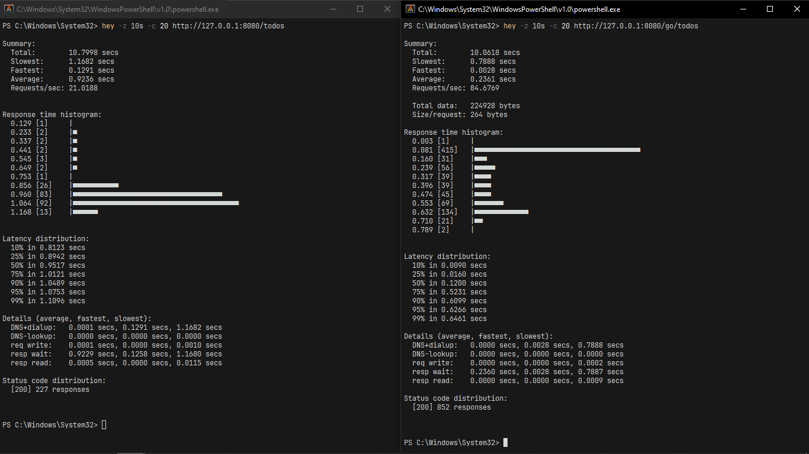
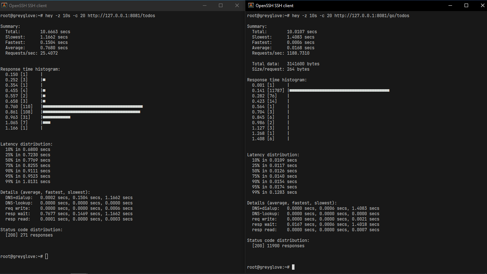

# laravel_vs_echo_benchmark

This project compares the performance and functionality of the Laravel PHP framework and the Echo Golang microframework. The example used is a simple CRUD API. Tech stack: Nginx, PostgreSQL, PgBouncer, PHP 8.4 Laravel 12, Go 1.24 Echo 4.13.4, Docker, Docker Compose.

I wanted to find libraries for Golang to write less code almost like in PHP. For example for pagination I found [upper/db](https://github.com/upper/db).

Everything is run through Docker Compose with a single command. For load testing I used [hey](https://github.com/rakyll/hey).





## Start

```sh
docker-compose up
```

## Stop

```sh 
docker-compose down --volumes
```

## Conclusion

Echo is on average 47.5 times faster than Laravel in terms of RPS on a €5/month VPS.
